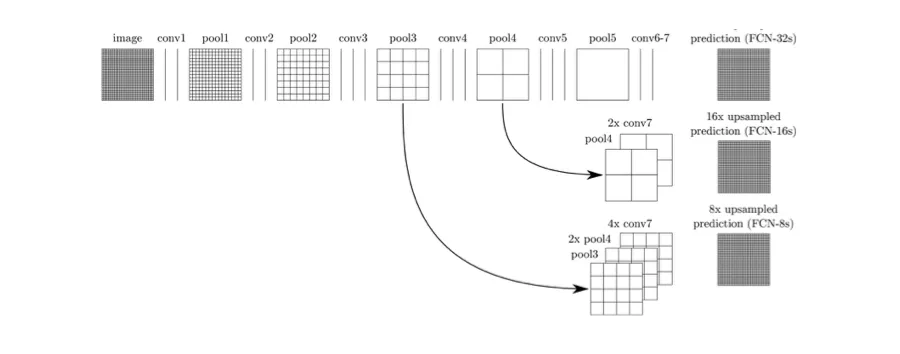
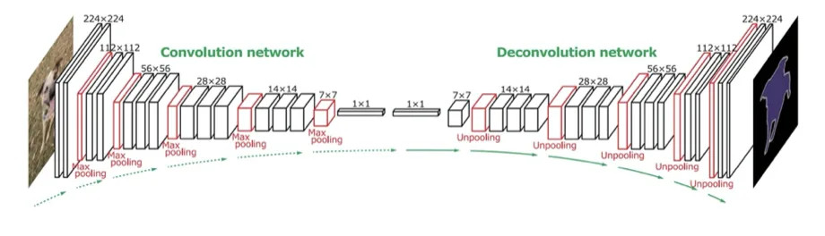
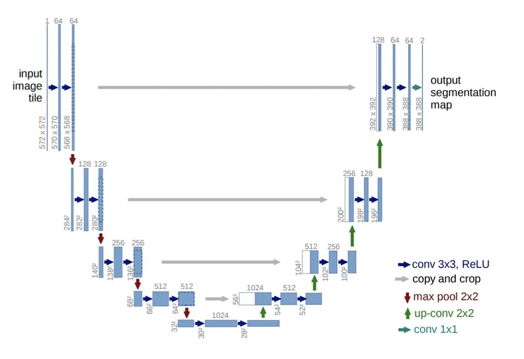
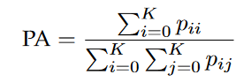
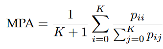
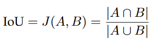
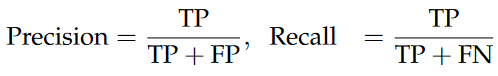
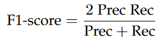
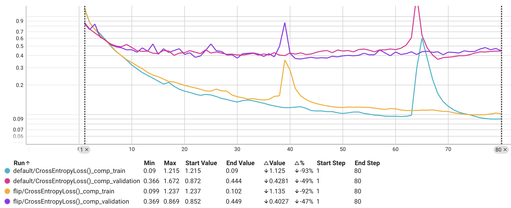

# Image Segmentation with Encoder Decoders

This repository contains the documentation and source code for experiments with encoder decoder models for image segmentation on different datasets.

## Team members

- Ehsan Yousefzadeh-Asl-Miandoab
- Marcel Thomas Rosier
- Andreas Møller Belsager

## Background

Computer vision is a sub-field in computer science field aiming at gathering, processing, analyzing, and understanding digital images and extracting information that can be used by numerical decision-making processes.

### Definition

The process of partitioning a digital image into multiple image segments (image regions, image objects), which indeed are sets of pixels. In other words, image segmentation can be viewed as pixel labeling too.

### Goal

Simplify the representation of a digital image into something easier to understand and analyze. An image is a grid of pixels.

### Domain and Applications

- Object detection tasks
  - Face detection
  - Pedestrain detection
  - Locating specific objects in satelite images
- Recognition tasks
  - Face recognition
  - Fingerprint recognition
- Object localization
- Traffic control systems
- Video survelliance systems

### Different kinds of image segmentation

- Semantic segmentation (e.g., person and background)
- Instance segmentation (e.g. each person will be identified individually)

### Traditional Computer Vision Approaches

- Thresholding method (Region-based Segmentation) ==> (changing a grayscale image into a binary image based a threshold)

- Edge Detection method

  - Using weight matrices (filters) and convoluting them with images

- Clustering method: e.g., K-means clustering

### DL-based Appoaches

Link to the paper: [paper](https://ieeexplore.ieee.org/document/9356353)

- Fully Convolutional Networks (FCNs) - These networks consist only of convolutional layers. Skip connections allow feature maps from final layers to be up-sampled and fused with feature maps of earlier layers, which helps the model to produce a very accurate and detailed segmentation by combining the semantic information from the deep and coarse layers with the appearance information from the shallow and fine layers.
  

- Convolutional Models with Graphical Models
  - These models came into existense as deep CNNs have poor localization property. So, the responses at the final CNN layers were combined with Conditional Random Field (CRF), which resulted in higher accuracy than the FCNs.
- **Encoder-Decoder Based Models (Our Focus in this project)** - It is divided into two main categories: 1. **Encoder-Decoder Models for General Segmentation**: They consist of two parts: encoder, decoder. An encoder uses convolutional layers, however, a decoder uses a deconvolutional network, which generates a maps of pixel-wise class probabilities based on the input feature vector. (popular models: **SegNet**, **HRNet**)
   2. Encoder-Decoder for Medical and biomedical Image Segmentation: **U-Net** and **V-Net** are the two most popular ones. **U-Net** is usually used for the segmenation of biological microscopy images, and **V-Net** is used for 3D medical image segmentation. It uses data augmentation to learn from the available annotated images. U-Net architecture consists of two parts: a contracting part and a symmetric expanding path, for capturing context and enabling precise localization respectively.
  
  **V-Net** uses a new objective function for model training which is based on **Dice coefficient**. V-Net model is trained on MRI volumes and predicts the segmentation for the whole MRI volume at once.
  

- R-CNN based Models (Instance sampling)
  - Regional Convolutional Neural Networks, the goal is to address the problem of instance segmentation.
- Multi-scale and Pyramid Network based Models

- Dilated Convolutional Models and DeepLab Family
- Recurrent Neural Network based Models
- Attention-based Models
- Generative Models and Adversarial Training
- CNN Models with Active Contour Models

Final comparison of the methods:

## Image Segmentation Datasets

The datasets for this task:

1. **The Cambridge driving labeled Video databases (CamVids) (our focus for this mini-project)**
2. The Cityscapes Dataset
3. PASCAL Visual Object Classes (PASCAL VOC)
4. Common Objects in COntext — Coco Dataset

## Evaluation Metrics

1. **Pixel Accuracy (PA)**: Ratio of pixels properly classified, divided by the total number of pixels. If we have K foreground classes with background. **pij** is the number of pixels of class i predicted as belonging to class j.

- **Mean Pixel Accuracy (MPA)**: Ratio of correct pixels is computed in a per-class manner and then averaged over the total number of classes.

- **Intersection over Union (IoU)**: the other name of this metric is **Jaccard Index**.

- **Mean-IoU**: is defined as the average IoU over all classes. It is widely used in reporting the performance of modern segmentation algorithms.

- **Precision/ Recall/ F1 Score**: precision and recall are defined as follows:

TP, FP, and FN stand for True Positive, False Positive, and False Negative, respectively.

- **F1 score**: is defined as harmonic mean of **precision** and **recall**.

- **Dice Coefficient**: this metric is commonly used in medical image analysis. It is defined as twice the overlap area of predicted and ground-truth maps, divided by the total number of pixels in both images.

## Encoder-Decoder based DL Models

### UNet Variations

For this project, we selected UNet model and looked at the following variants of it.

1. UNet + ReLU
2. UNet + Leaky ReLU
3. small UNet + ReLU
4. small UNet + Leaky ReLU
5. extended UNet + ReLU
6. extended UNet + Leaky ReLU
7. extended UNet + ReLU + Dropout
8. overextended UNet + ReLU
9. overextended UNet + Leaky ReLU
10. overextended UNet + ReLU + Dropout

### Pretrained FCN ResNet 50

Using a pretrained [FCN_RESNET50 model](https://pytorch.org/vision/main/models/generated/torchvision.models.segmentation.fcn_resnet50.html) provided by torchvision we finetune on all layers and change the classifier and [aux classifier](https://paperswithcode.com/method/auxiliary-classifier#:~:text=Auxiliary%20Classifiers%20are%20type%20of,the%20end%20of%20the%20network) to have an output size of 32 channels.

#### Trained variations

1. default
1. flip (Default with data augmentation Random Horizontal Flip)

#### Training

#### Eval

- Augmentation does not seem to improve results. Could however also be a bug in the way the augmentation was done, sadly no time for a rerun
- Final Loss (default):
  - Train: 0.118
  - Val: 0.404
- IOU (default): 0.272  
  values seems too low?: maybe wrong usage since for the resnet pytorch and the JaccardIndex from torchmetrics was used while the UNet training and evaluation was done in TensorFlow

## State of the art approach

|TODO andres: Please add your summary of your research here on the state-of-the-art practice on image segmentation with encoder-decoder mechanisms

1. motivation of this work
2. advantage
3. improvement
4. a short description of the model

### CNN and Transformer mix

https://reader.elsevier.com/reader/sd/pii/S0031320322007075?token=83FCA21D1027C3BFBF95656B895BEF0A262DF1328A65F90845CA8D0D34707028CBA43303B74BCF9E3624B7F3937DE7AB&originRegion=eu-west-1&originCreation=20230504124206

1. In the domain of medical imaging, a big problem has been cases of organ identification images, where some organs are small or thin while other are big. Many models typically have problems capturing especially the small and thin ones. Therefore, in the paper, they propose a model that mixes a CNN with a transformer model, such that they run in parallel with each other. They do this as transformer models have proven to be good at the task of long distance relationships. That makes it easier for the model to capture these small details in images, that would normally not be captured by standard CNN models.
   The model evaluated to pretty average results when compared to other state of the art models, yet especailly for the smaller organs in the images, the model gave improvements (while for bigger organs, the model had slightly lower performance).
